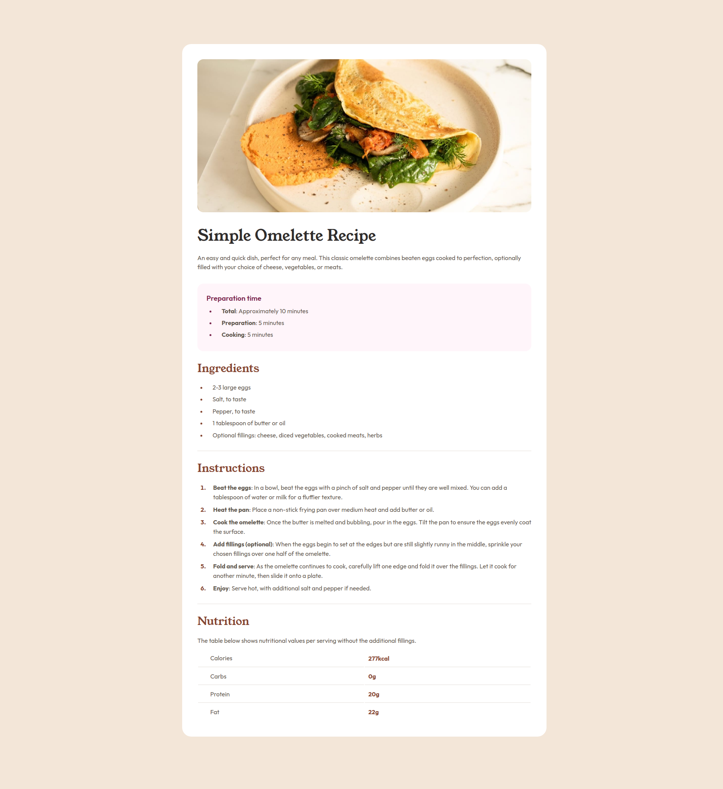

# Frontend Mentor - Recipe page solution

This is a solution to the [Recipe page challenge on Frontend Mentor](https://www.frontendmentor.io/challenges/recipe-page-KiTsR8QQKm). Frontend Mentor challenges help you improve your coding skills by building realistic projects. 

## Table of contents

- [Overview](#overview)
  - [Screenshot](#screenshot)
  - [Links](#links)
- [My process](#my-process)
  - [Built with](#built-with)
  - [What I learned](#what-i-learned)
  - [Continued development](#continued-development)
- [Author](#author)

## Overview

### Screenshot

### Links

- Solution URL: (https://duanfm-recipe-page.netlify.app)
- Live Site URL: (https://duanfm-recipe-page.netlify.app)

## My process

### Built with

- Semantic HTML5 markup
- CSS

### What I learned

I learned how to target list markups with CSS.
I strengthened my responsive web design skills.

### Continued development

I want to focus on improving my CSS skills and better learn how to use the right CSS unit for the right circumstance.

## Author

- Website - [Duan](https://duanfm-recipe-page.netlify.app)
